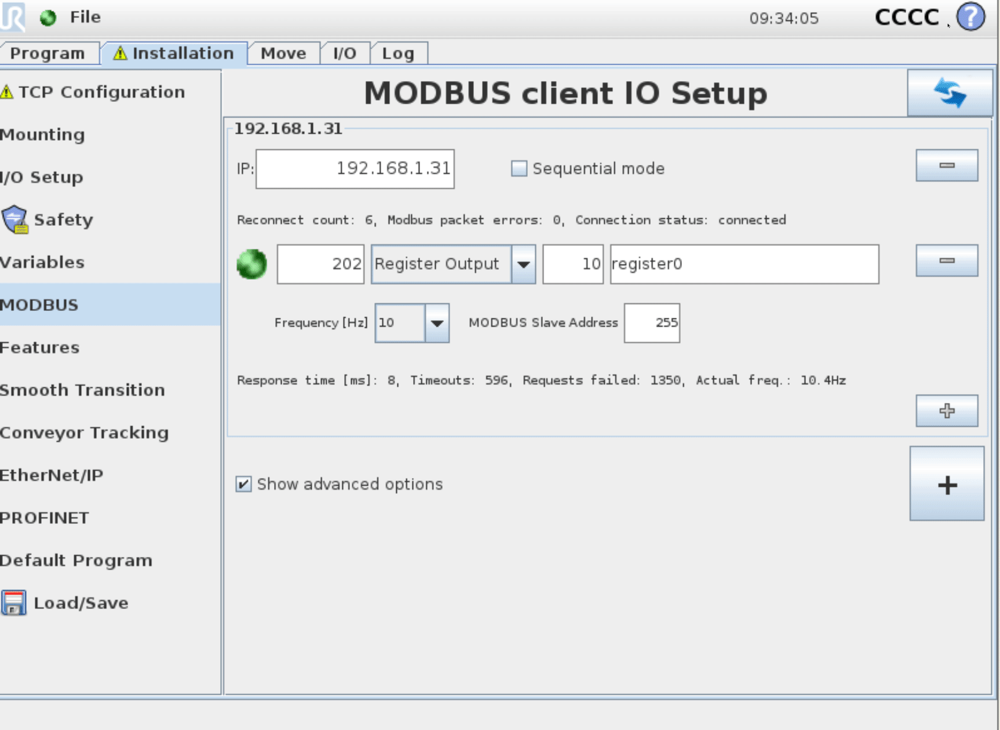
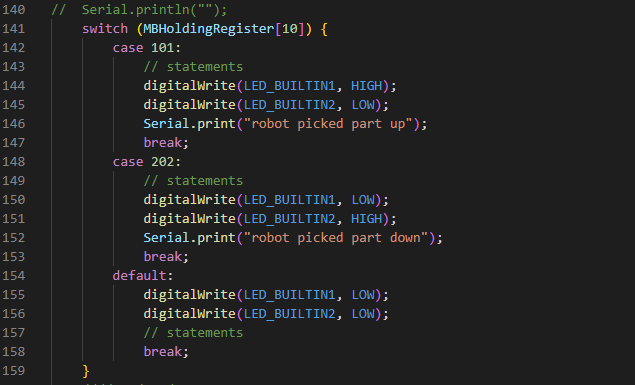

# Modbus TCP server on NodeMCU0.9 communicating with a UR-robot (via URSim)
Playing some more with Modbus TCP on a NodeMCU0.9 using PlatformIO in VS-code and Universal Robots

Made a simple control of holdig register 10 (40011). By sending 101 or 202 it will light up leds on the ESP and sent a message via the terminal (baud 9600)

have fun - and remeber, only 1 client can be connected to a modbus server a time.

I also tested it with a Universal Robot CB3 sim (URSim), you can find my code in the folder (UR3CB3-SimpleESPModbusComm).
You can downloaded it from UR Homepage (https://www.universal-robots.com/)

**As always... Have fun with the data and code**
